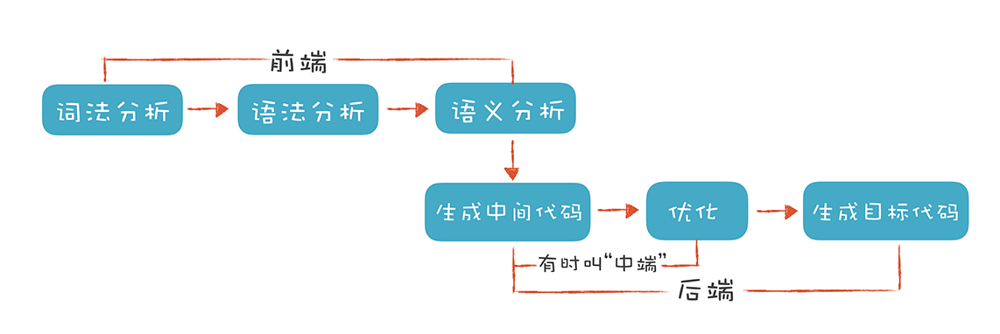
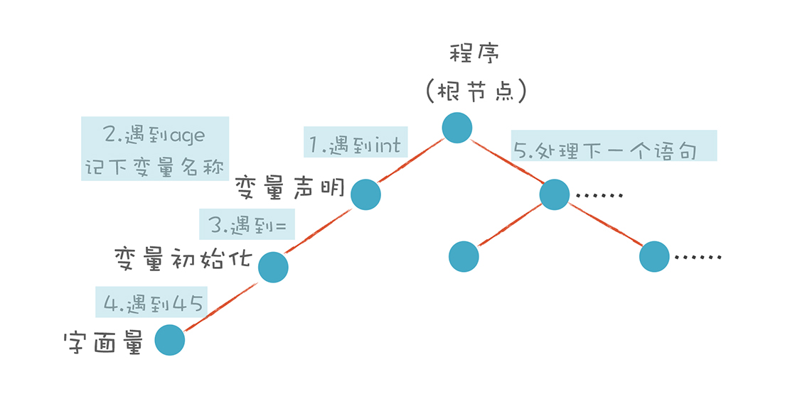
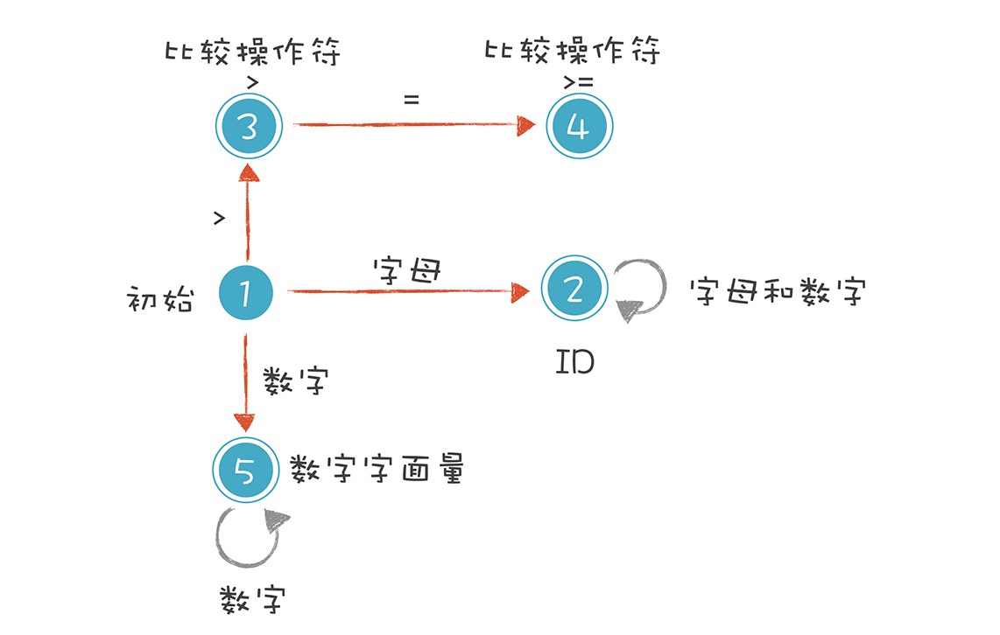

## 为什么学习编译原理

## 01. 理解代码：编译器的前端技术

前端(Front End):编译器对程序代码的分析和理解过程

后端(Back End):生成目标代码的过程，跟目标机器有关

### 词法分析(Lexical Analysis)

Token 

### 语法分析(Syntactic Analysis,or Parsing)

抽象语法树(Abstract Syntax Tree,AST)

https://resources.jointjs.com/demos/javascript-ast

递归下降算法(Recursive Descent Parsing)

### 语义分析(Semantic Analysis)

### In conclusion

1. 词法分析是把程序分割成一个个Token的过程，可以通过构造有限自动机实现

2. 语法分析是把程序的结构识别出来，并形成一棵便于由计算机处理的抽象语法，可以用递归下降的算法来实现

3. 语义分析是消除语义模糊，生成一些属性信息，让计算机能依据这些信息生成目标代码

## 正则文法和有限自动机:纯手工打造词法分析器

1. 解析 age >= 45(关系表达式)

标识符:第一个字符必须是字母，后面的字符可以是字符或数字

比较操作符: > 和 >= (其他比较操作符暂时忽略)

数字字面量: 全部由数字构成(像带小数点的浮点数，暂时不管)

1.初始状态：刚开始启动词法分析的时候，程序所处的状态。

2.标识符状态：在初始状态时，当第一个字符是字母的时候，迁移到状态 2。当后续字符是字母和数字时，保留在状态 2。如果不是，就离开状态 2，写下该 Token，回到初始状态。

3.大于操作符（GT）：在初始状态时，当第一个字符是 > 时，进入这个状态。它是比较操作符的一种情况。

4.大于等于操作符（GE）：如果状态 3 的下一个字符是 =，就进入状态 4，变成 >=。它也是比较操作符的一种情况。

5.数字字面量：在初始状态时，下一个字符是数字，进入这个状态。如果后续仍是数字，就保持在状态

### 注意结构体的引用问题 (typedef struct)

https://cloud.tencent.com/developer/ask/123992

https://stackoverflow.com/questions/60410314/why-does-using-struct-work-but-typedef-struct-not

